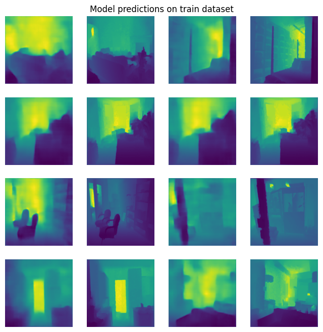
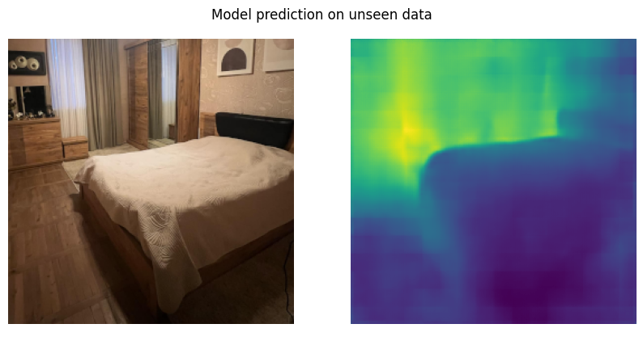
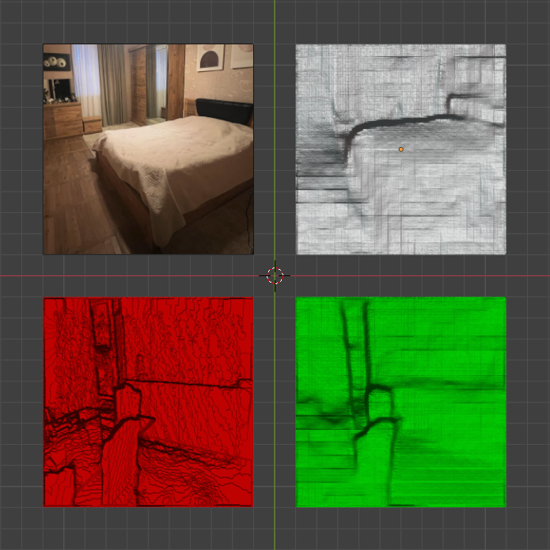

# Depth perception model

Depth perception model trained on [NYU depth dataset](https://www.kaggle.com/datasets/soumikrakshit/nyu-depth-v2).

**Made by Nick Kipshidze!**

> The whole model was made by me, except for the pretrained ResNet18 backbone used for feature extracton (encoding). The model was trained on Nvidia Tesla T4 GPU, for couple hours.

## Model inference

### Train/test datasets

Predictions and dataset comparison plots. Odd numbered columns are the original data, even numbered columns are the model predictions.

    
    

### Unseen data

Model performance on unseen data. Picture taken by me.

## Model prediction 3D visualizations

Visualizations were made by me, yours truly, Nick Kipshidze. Using Blender's scripting API. Top left is original image, top right is model's prediction. Bottom left is dataset groud truth, bottom right is model's prediction again.

To better understand the 3D visuals, I made it into a GIF.

## Extras

Thanks for reading my README to the end! I hope you like this project and find it amusing, because I sure did have fun making it! In total it took around 6 hours to make this project, and I made it all in one sitting.

For the most part I didn't use ChatGPT. SSIM part of the loss is from `Po-Hsun-Su/pytorch-ssim` and I just borrowed the code. The decoder part of the NN is something I came up with in couple minutes, inspired by my old GAN networks.

If you liked my project, leave a star!

If you want to know more about how I made this project in just couple hours, in a single day, you can email me at `kipshidze.nick@gmail.com`. I would be happy to explain **any** part of the code, or how my crazy Blender script works.
